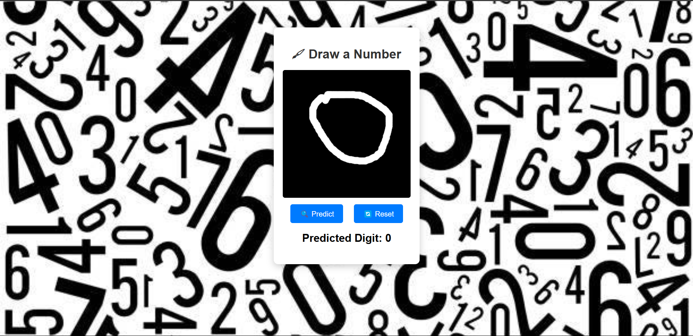
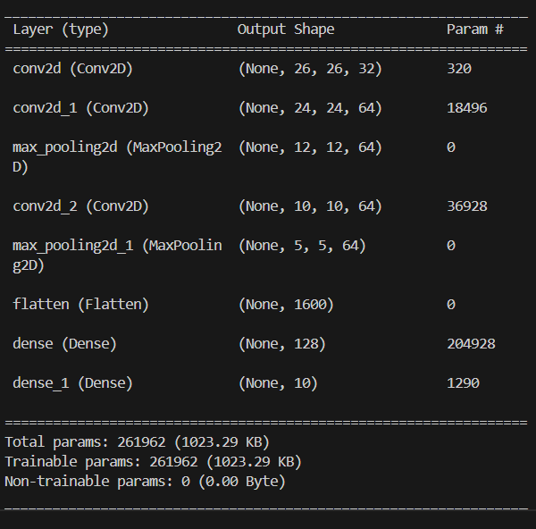
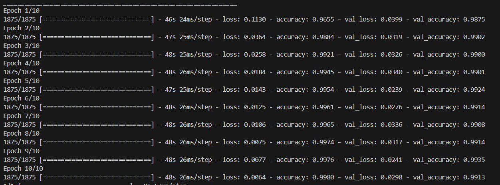
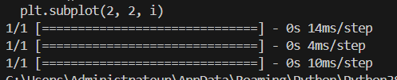
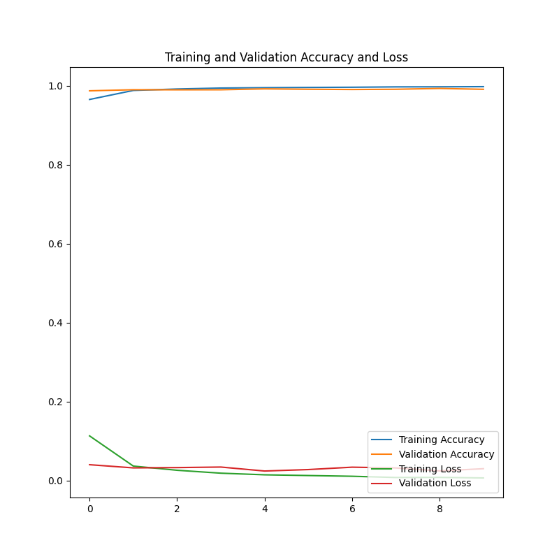
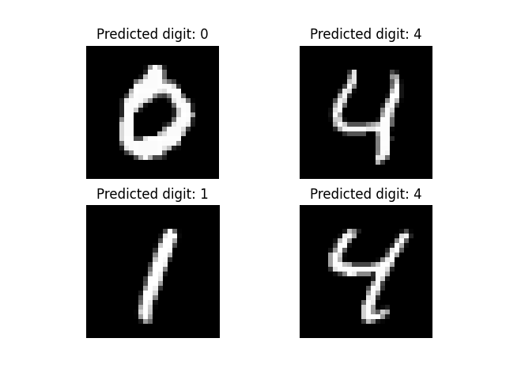

# 🖍 Handwritten Digit Recognition Web App

This is a **Flask-based** web application that allows users to draw a handwritten digit on a canvas and get a model prediction using a **CNN (Convolutional Neural Network)**. The model is trained on the **MNIST dataset** and achieves an accuracy of **~98%**. This project is designed to be user-friendly, responsive, and easy to set up.

---

## 📌 Demo
### 🎨 Draw a number on the canvas & get predictions!


---

## 🎯 Features
✅ **Live Drawing Canvas** – Draw any digit (0-9)  
✅ **CNN Model Prediction** – Uses a pre-trained model  
✅ **Responsive UI** – Works on desktop & mobile  
✅ **Reset Button** – Redraw multiple times  
✅ **High Accuracy (~98%)** – Trained on MNIST dataset  
✅ **Easy Setup** – Simple installation and deployment  

---

## � Project Structure
The project is organized as follows:

```
handwritten-digit-recognition/
├── static/            # Contains CSS, JS, and images
├── templates/         # HTML files for the web interface
├── model/             # TensorFlow/Keras pre-trained model
├── app.py             # Flask backend server
├── requirements.txt   # Python dependencies
├── README.md          # Project documentation
└── img/Figures/           # Contains training and evaluation visuals
```

---

## 📊 Model Performance
The model was trained using the **MNIST dataset**, achieving an accuracy of **98%**. Below are sample predictions:

| **Input Image** | **Predicted Digit** |
|----------------|--------------------|
|  | 3 |
|  | 7 |


---

## 📈 Training and Evaluation
The model was trained using a **Convolutional Neural Network (CNN)**. Below are the key metrics and visualizations:

### Model Architecture


### Training Process


### Test Pipeline


### Accuracy and Loss Curves


### Sample Predictions


---

## 🛠 Installation Guide
### **1️⃣ Install Dependencies**
Make sure you have Python 3.7+ installed. Then, install the required dependencies using:
```bash
pip install -r requirements.txt
```

### **2️⃣ Run the Flask Application**
Start the Flask server by running:
```bash
python app.py
```

### **3️⃣ Access the Web App**
Open your browser and navigate to:
```
http://127.0.0.1:5000/
```

---

## 🧪 Testing the Web App
To test the web app, follow these steps:
1. Draw a digit (0-9) on the canvas.
2. Click the **Predict** button to see the model's prediction.
3. Use the **Reset** button to clear the canvas and try again.

### Example Test Results


---

## 🚀 Future Enhancements
- **Improve Model Accuracy**: Experiment with advanced architectures like ResNet or EfficientNet.
- **Multi-digit Recognition**: Extend the model to recognize multiple digits.
- **User Authentication**: Add user accounts to save and track predictions.
- **Deployment**: Deploy the app on cloud platforms like AWS, Heroku, or Google Cloud.

---

## 🤝 Contributing
Contributions are welcome! If you'd like to contribute, please follow these steps:
1. Fork the repository.
2. Create a new branch for your feature or bug fix.
3. Submit a pull request with a detailed description of your changes.

---

## 📜 License
This project is licensed under the MIT License. See the [LICENSE](LICENSE) file for details.

---

## 🙏 Acknowledgments
- **MNIST Dataset**: For providing the training data.
- **TensorFlow/Keras**: For the deep learning framework.
- **Flask**: For the web application framework.

---

## 📧 Contact
For any questions or feedback, feel free to reach out:
- **Email**: [Your Email]
- **GitHub**: [Your GitHub Profile]
- **LinkedIn**: [Your LinkedIn Profile]

---

Enjoy using the Handwritten Digit Recognition Web App! 🎉